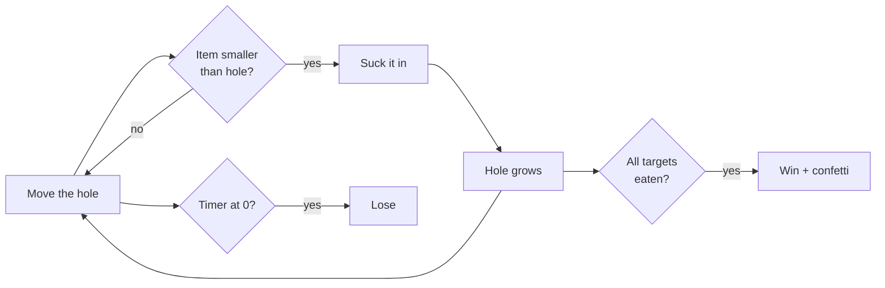
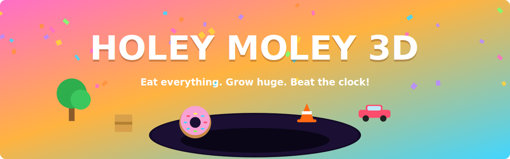
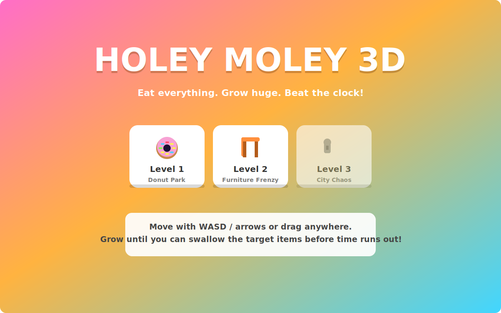
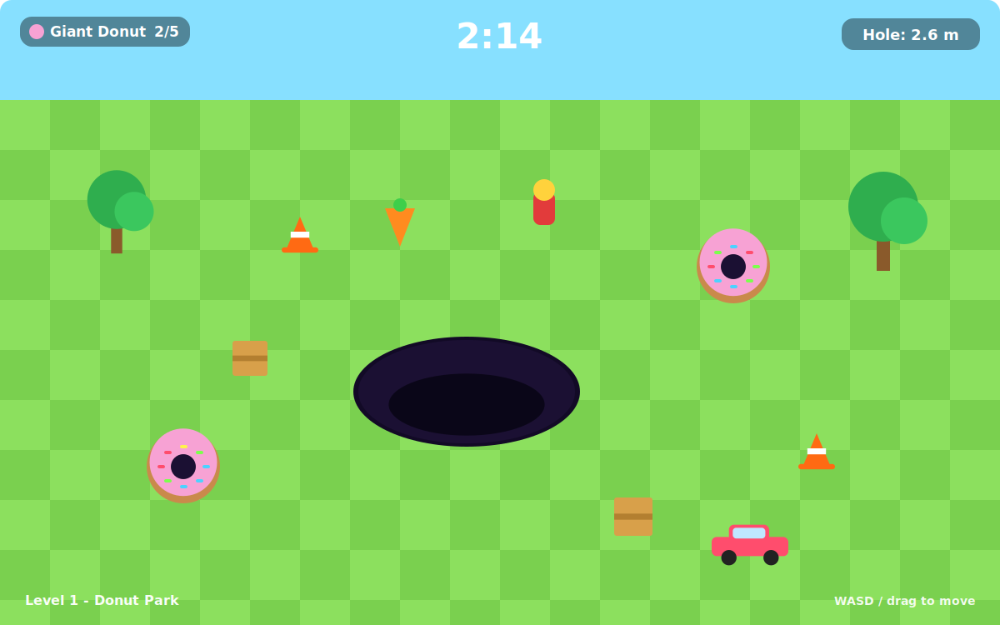
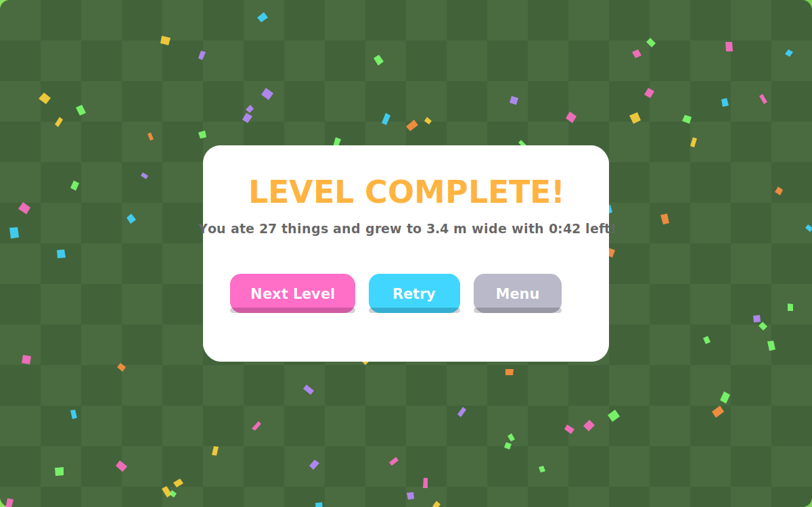

# Holey Moley 3D

A hole.io-style browser game I built in a Cowork session with Claude. You steer a hole around a colorful arena, swallow anything smaller than you, grow with every bite, and race a three-minute clock to eat the level's target items. The whole game is one HTML file with no build step.

## How it works

You start small — only rocks, carrots, and traffic cones fit in the hole. Everything you eat makes the hole wider (growth is area-based, so big items matter much more than small ones). The level's target items are too big for you at first; the loop is to hoover up the small stuff until the targets fit, then swallow them before time runs out.



## What it does

There are three levels, each 3 minutes. Level 1 (Donut Park) asks for 5 giant donuts. Level 2 (Furniture Frenzy) wants 4 chairs and 2 tables, starting you smaller and growing you slower. Level 3 (City Chaos) demands 3 cars, 2 streetlamps, and 3 fire extinguishers in a bigger arena with the stingiest growth curve. Each arena scatters 40–60 items across 17 procedurally-built types — trees, hydrants, benches, barrels, mailboxes and so on — as fodder.

You move with WASD, arrow keys, or by dragging (touch works). Items near the rim get tugged toward the hole; items still too big for you wobble as you pass under them, which doubles as a hint. The HUD tracks the timer, your current width, and per-target progress chips that turn green when done. Winning a level unlocks the next on the menu. Win or lose, you get confetti — bright and celebratory for wins, moody blue for losses — plus synthesized sound effects via the Web Audio API (no audio files).

## What it looks like

These images are SVG mockups generated from the game's actual palette and layout by `docs/make_screens.py` — the sandbox this was built in has no browser, so they're illustrative rather than live captures. What you see in-game is the real-time 3D version of the same scenes.









## How it's put together

Everything lives in `index.html`: CSS for the menus and HUD, and one script that runs the game on Three.js (r128, loaded from a CDN). The hole itself is a rendering trick — the ground is a shader that discards fragments inside the hole's radius, with a dark cylinder and rim ring underneath to sell the depth. Items are groups of primitive geometry (boxes, cylinders, spheres, a torus for the donuts) rather than loaded models, so there are no assets to download. "Physics" is faked: items inside the radius fall, shrink, and get pulled to the center; there's no physics engine. Levels are plain config objects (spawn tables, targets, growth rate, arena size), so adding a level is adding one entry. Progress lives in memory only — a refresh resets unlocks.

## Running it

Open `index.html` in a browser. That's it — though it does need internet access the first time to fetch Three.js from cdnjs. If your browser is picky about local files, serve it:

```
python -m http.server
```

then visit `http://localhost:8000`.

To regenerate the README screens: `python3 docs/make_screens.py`.

## Honest caveats

Difficulty tuning is first-pass guesswork — some levels may be too easy or too hard. There's no persistence, no pause button, no mobile joystick UI (drag works but is bare-bones), and no AI rival holes like the real hole.io. The item "physics" is smoke and mirrors, and the game needs a CDN connection for Three.js. The preview images above are mockups, not screenshots.

## License

MIT — use it, fork it, learn from it, ship your own version; just keep the license notice. See [LICENSE](LICENSE).
